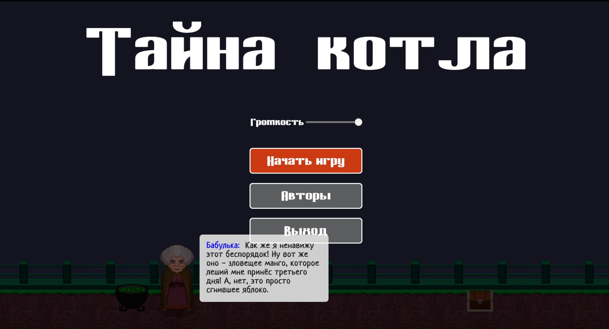
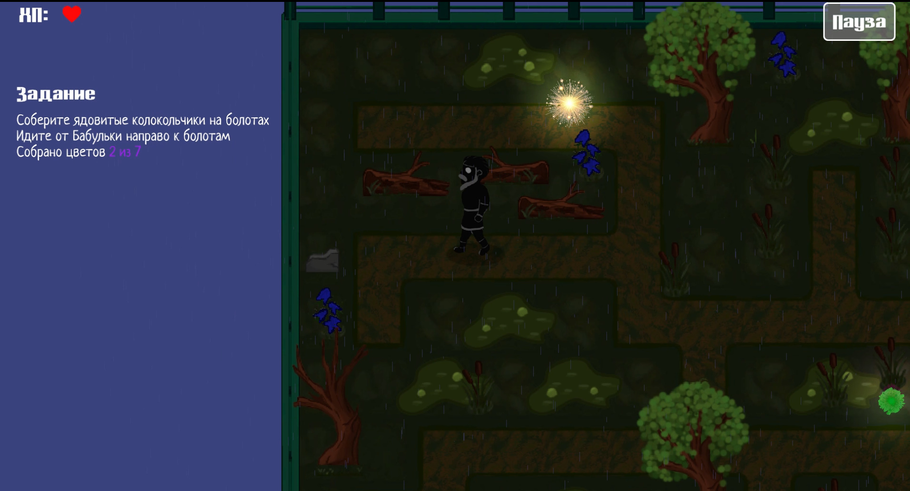
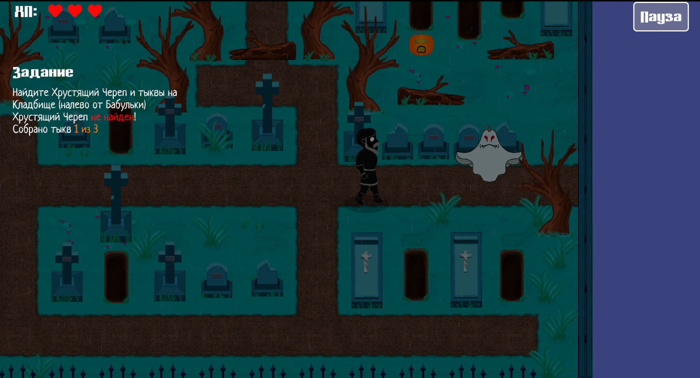

# The Secret of the Cauldron

A 2D adventure game created during a game jam using Unity.

## Play Online

🎮 **WebGL Build:**  
https://alexgilevskiy.itch.io/the-secret-of-the-cauldron

## About

Developed by a team of 5 participants during a game development jam.

The Secret of the Cauldron is a story-driven adventure game where players explore mysterious locations, interact with NPCs, collect quest items, battle enemies, and uncover the secrets surrounding an ancient magical cauldron.

## Overview

The Secret of the Cauldron is a story-driven adventure game where the player explores mysterious locations, completes quests, collects ingredients, and helps an eccentric old witch brew a magical potion.

The game features multiple themed locations, interactive NPCs, item collection mechanics, simple combat, quest progression, and atmospheric visual effects.

## Features

- 2D top-down exploration
- Quest system
- NPC dialogues
- Item collection
- Enemy encounters
- Interactive environment
- Multiple locations
- Atmospheric weather and visual effects
- Pause menu and settings

## Technologies

- Unity
- C#
- 2D Animation
- Unity UI
- Tilemaps

## My Contribution

Role: Game Designer, Level Designer, VFX Designer

Responsibilities:

- Designed gameplay flow
- Created level layouts
- Designed quests and progression
- Implemented environmental visual effects
- Participated in playtesting and balancing

## Team

- Anastasia Borovikova - 2D Artist
- Alexander Gilevsky - Programmer, Animator
- Evgeny Istomin - Sound Designer, Composer
- Denis Kovtun - Programmer, Game Designer, Narrative Designer
- Ivan Korolev - Game Designer, Level Designer, VFX Designer

## Controls

| Key | Action |
|-------|-------|
| W A S D | Move |
| Arrow Keys | Move |
| Space | Attack |
| Left Mouse Button | Attack |
| E | Interact |
| Esc | Pause |

## Screenshots

## Project Status

Completed game jam project.

## Links

🎮 Play Online (WebGL):
https://alexgilevskiy.itch.io/the-secret-of-the-cauldron

🎨 ArtStation:
https://www.artstation.com/projecthouru

💻 GitHub:
https://github.com/ProjectHouru/the-secret-of-the-cauldron